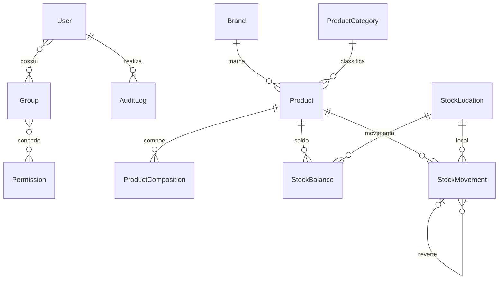
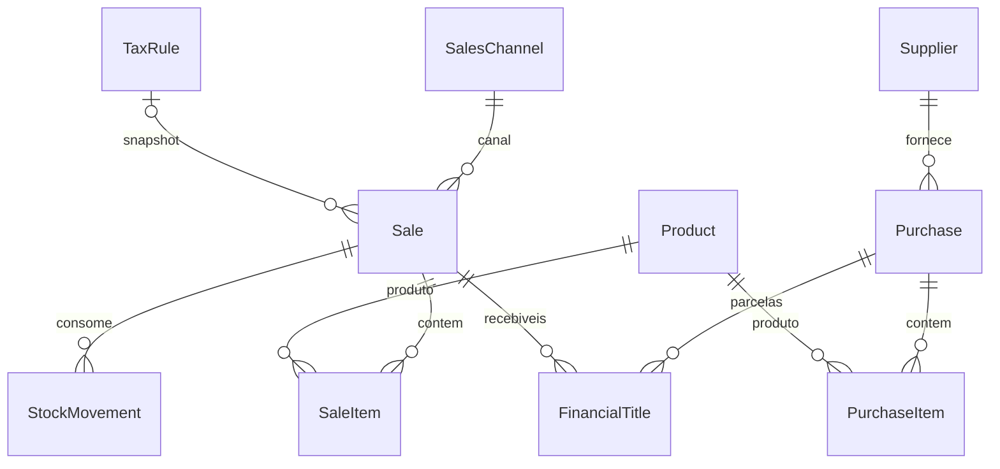
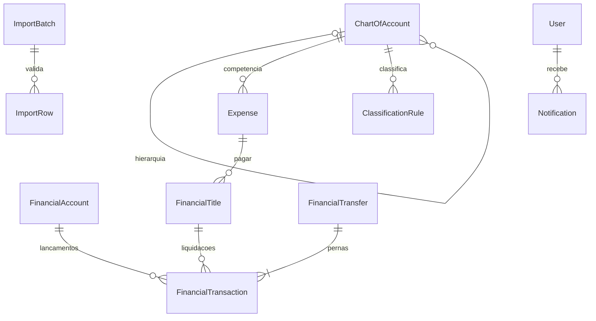

# Modelo de dados
Modelo alvo; implementação real identificada no BACKLOG. Não existem tabelas mensais. Datas são atributos. FKs históricas usam PROTECT e transações possuem status/reversões. Group e Permission nativos representam Role e Permission.

## Campos e restrições do modelo alvo
- Product: SKU único, status, tipo, marca, categoria, unidade, mínimo, quantidade/valorização global e custo médio.
- StockBalance: unique(produto, local), quantidade não negativa.
- StockMovement: quantidade/valor assinados, custo snapshot, ator, data efetiva, horário do registro, origem, referência e reversal_of.
- Sale: série/NF únicas quando preenchidas, canal/data indexados, estado, valores, regra/alíquota/base/imposto snapshot; SaleItem com quantidade, SKU/nome/custo/CMV snapshot.
- Purchase: fornecedor/documento/data/status/itens. FinancialTitle substitui duplicação de estruturas de parcelas de compra e recebíveis de vendas.
- FinancialTitle: origem, tipo pagar/receber, vencimento, valor, competência quando aplicável, estado e flag de abertura.
- FinancialTransaction: conta/data/tipo/valor/status/ator, origem, vínculo de liquidação e reversão. Transferência gera duas pernas do mesmo valor.
- ChartOfAccount: código único, pai opcional, natureza DRE/patrimonial, status.
- ImportBatch: origem/hash/arquivo/metadados/contadores; ImportRow: conteúdo validado, erros e registro criado. unique(source, external_id) nos destinos pertinentes.

NUMERIC: quantidades 4 casas, custo/valorização 6, dinheiro 2. Índices por vencimento/status, conta/data, canal/data, produto/local. IDs internos independem de SKU/NF.
