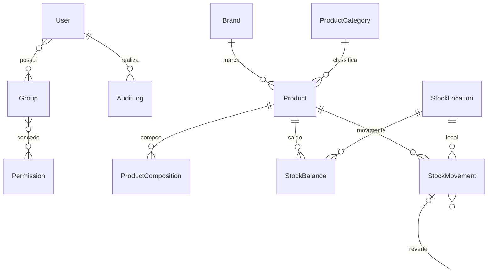
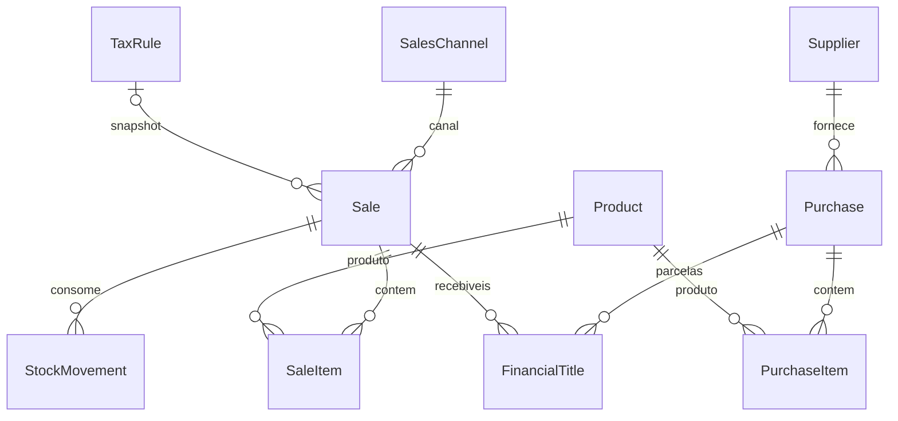
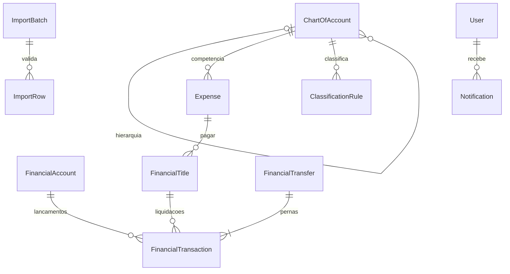
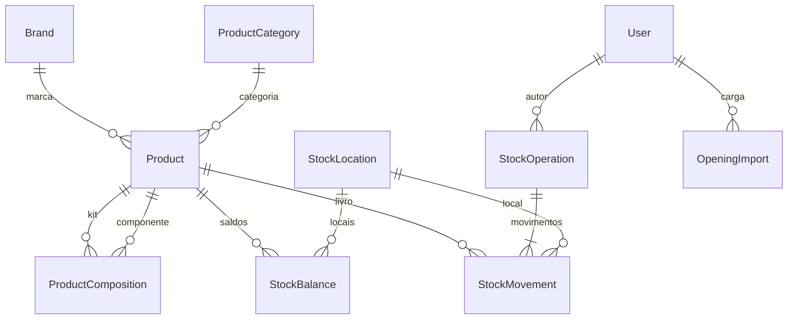
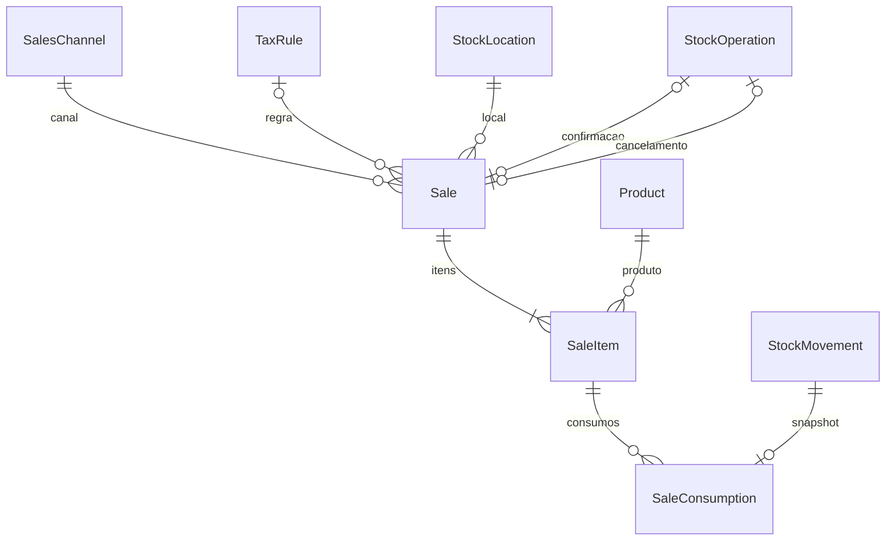
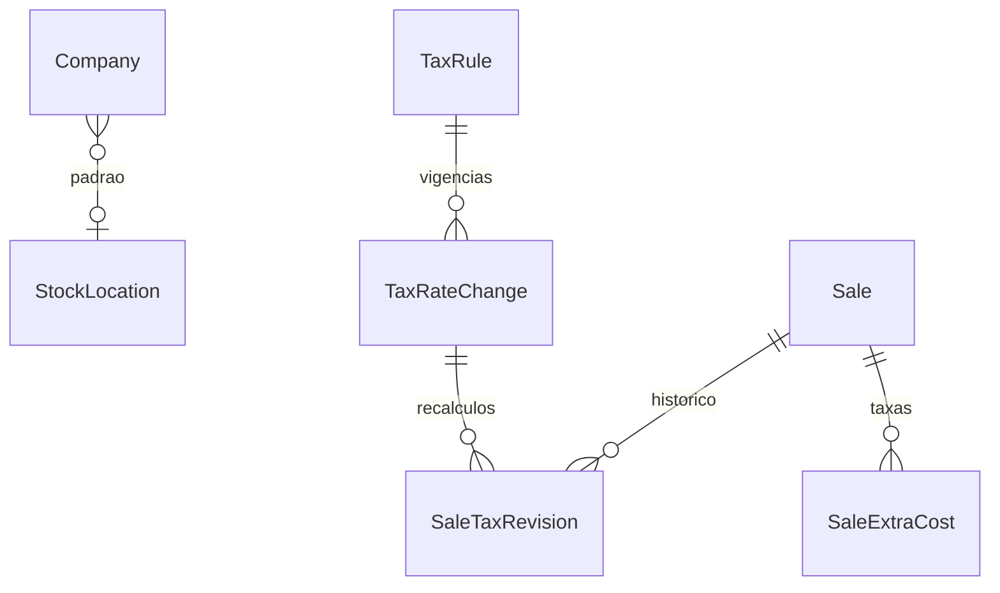
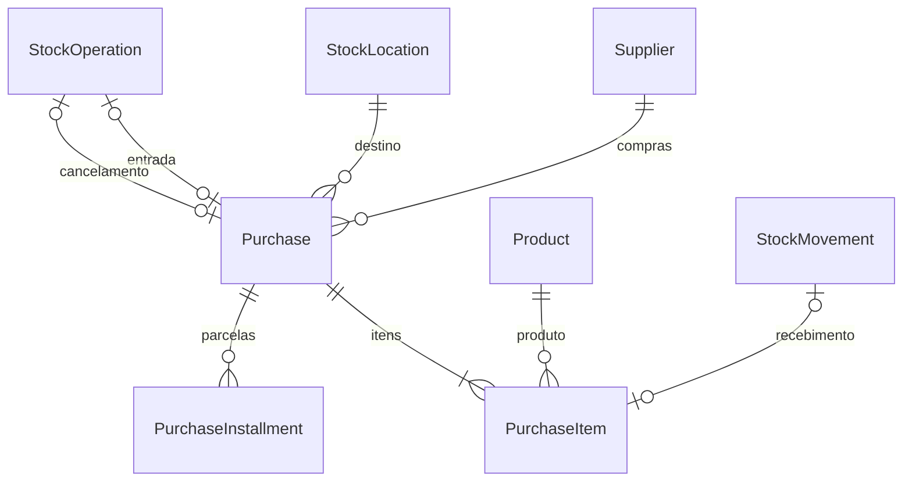
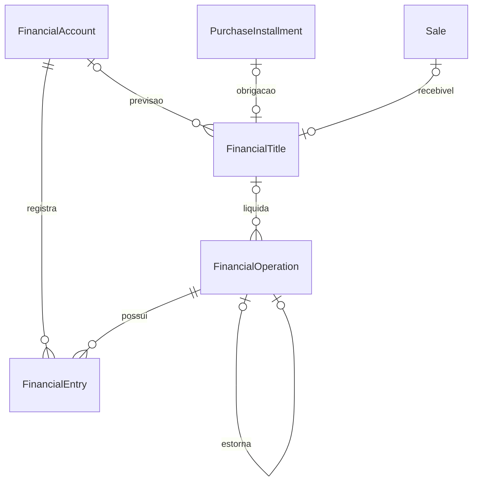
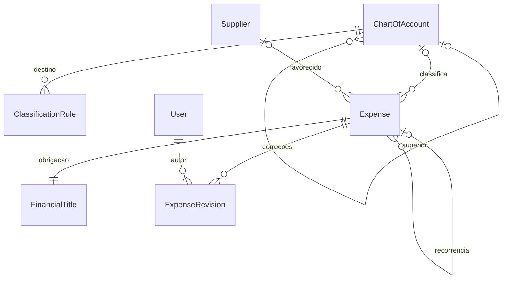
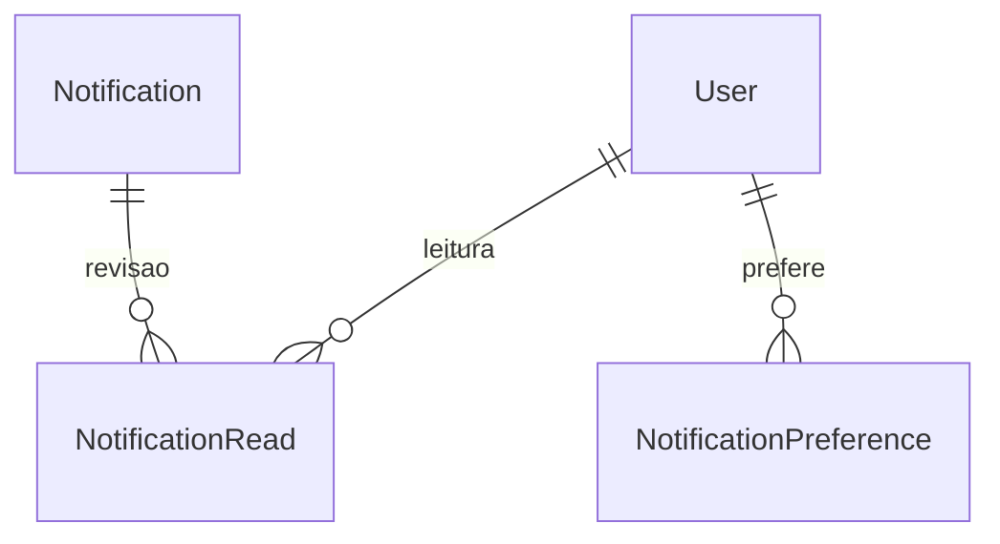

# Modelo de dados
Modelo alvo; implementação real identificada no BACKLOG. Não existem tabelas mensais. Datas são atributos. FKs históricas usam PROTECT e transações possuem status/reversões. Group e Permission nativos representam Role e Permission.

## Campos e restrições do modelo alvo
- Product: SKU único, status, tipo, marca, categoria, unidade, mínimo, quantidade/valorização global e custo médio.
- StockBalance: unique(produto, local), quantidade não negativa.
- StockMovement: quantidade/valor assinados, custo snapshot, ator, data efetiva, horário do registro, origem, referência e reversal_of.
- Sale: série/NF únicas quando preenchidas, canal/data indexados, estado, valores, regra/alíquota/base/imposto snapshot; SaleItem com quantidade, SKU/nome/custo/CMV snapshot.
- Purchase: fornecedor/documento/data/status/itens. FinancialTitle substitui duplicação de estruturas de parcelas de compra e recebíveis de vendas.
- FinancialTitle: origem, tipo pagar/receber, vencimento, valor, competência quando aplicável, estado e flag de abertura.
- FinancialTransaction: conta/data/tipo/valor/status/ator, origem, vínculo de liquidação e reversão. Transferência gera duas pernas do mesmo valor.
- ChartOfAccount: código único, pai opcional, natureza DRE/patrimonial, status.
- ImportBatch: origem/hash/arquivo/metadados/contadores; ImportRow: conteúdo validado, erros e registro criado. unique(source, external_id) nos destinos pertinentes.

NUMERIC: quantidades 4 casas, custo/valorização 6, dinheiro 2. Índices por vencimento/status, conta/data, canal/data, produto/local. IDs internos independem de SKU/NF.

## Entidades concretas da Fase 2

Product mantém quantity/value/average_cost como projeção; StockBalance quantidade por local. StockMovement guarda deltas de quantidade/valor, custo unitário e posição global antes/depois. StockOperation agrupa tipo, data, motivo, autor, chave idempotente, hash do pedido e ligação única de estorno. OpeningImport guarda hash do arquivo e relatório, sem anexar a planilha ao repositório. Brand/ProductCategory/StockLocation têm ativo/inativo.

## Implementação da Fase 3
As seguintes entidades agora existem em migrations, além do modelo futuro descrito acima.

Sale armazena data comercial, NF/série únicas, UUID de criação, revisão, valores, snapshot tributário/margem mínima, estado e atores/horários. SaleItem conserva SKU/nome, quantidade, custo unitário e CMV. SaleConsumption liga cada componente efetivamente baixado ao item; imutável. Operações de estoque usam data física atual. Cancelamento preserva snapshots e vincula retorno ao movimento original.

## Adaptações da Fase 3
Company.default_stock_location referencia StockLocation (opcional em instalação existente). Sale.extra_costs_total agrega SaleExtraCost; linhas congeladas após confirmação. TaxRateChange registra novas alíquotas/base por data; SaleTaxRevision conserva recálculos individuais imutáveis.

## Implementação da Fase 4

Purchase armazena totais, revisão/UUID, documento/série únicos por fornecedor, estados e atores/datas. PurchaseItem conserva preço, subtotal, rateio monetário, custo unitário e SKU/nome. PurchaseInstallment contém obrigação planejada ou confirmada; na Fase 5, situação financeira deriva do título vinculado. Triggers protegem snapshots confirmados/recebidos e permitem vincular movimento no recebimento e cancelar parcelas.

## Fase 5 — entidades implementadas

FinancialTitle: direção, origem, principal, baixado, vencimento, conta prevista, categoria básica, abertura, status, revisão, UUID, ator/timestamps e fonte. FinancialOperation: UUID/fingerprint, tipo/status/data, principal/juros/desconto/efetivo e reversão única. FinancialEntry: conta/operação/valor com sinal; livro imutável. Saldo diário é derivado, não tabela editável.

## Fase 6 — entidades implementadas

Expense conserva competência, documento, valor NUMERIC, fornecedor/favorecido, categoria/caminho/natureza e regra snapshots, centro de custo, status, UUID/fingerprint, título único, base/índice de recorrência, revisão e atores/datas. Restrição positiva e unique(base,índice). ExpenseRevision conserva motivo e antes/depois imutáveis. Plano tem código único, pai protegido, natureza e grupo/analítica. Relações concretas acima substituem a cardinalidade futura inicial de Expense/FinancialTitle.

## Fase 8 — notificações

Notification identifica condição única por tipo/entidade, conteúdo, severidade, revisão, resolução e timestamps. NotificationRead tem unique(notificação, usuário); revisão lida permite reabrir avisos atualizados. NotificationPreference tem unique(usuário, tipo). AlertConfiguration é singleton com habilitação global, antecedência, prazo de backup, início e última execução. BackupEvidence registra resultado, data, bytes e SHA-256; sucesso exige evidência não vazia. Relação polimórfica de Notification é resolvida pelo tipo e ID, com links fixos e autorização dinâmica, sem exclusão do histórico.
